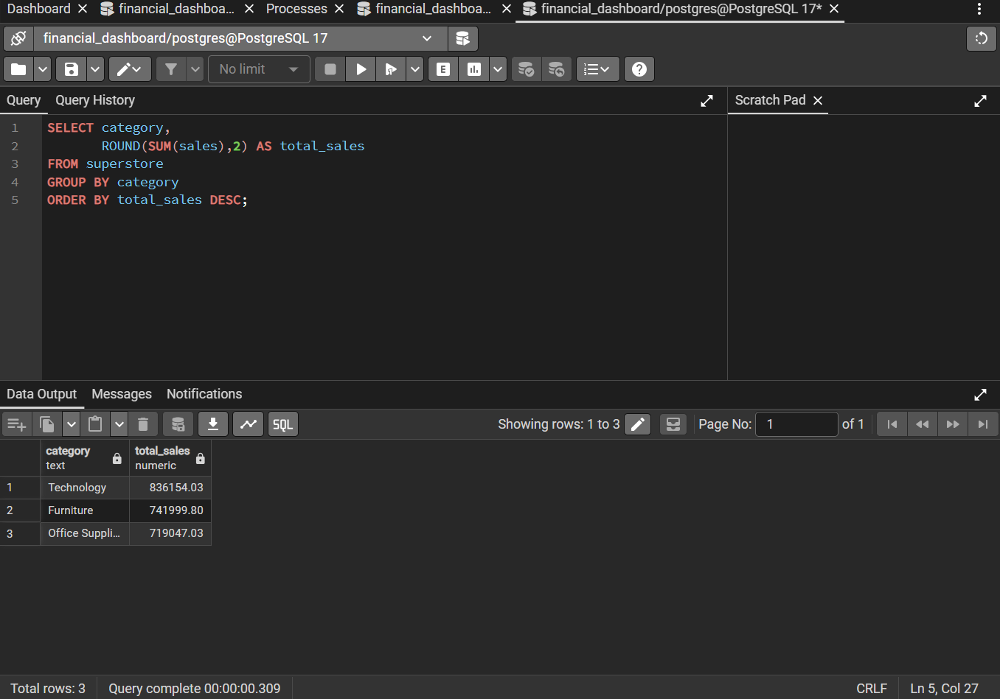
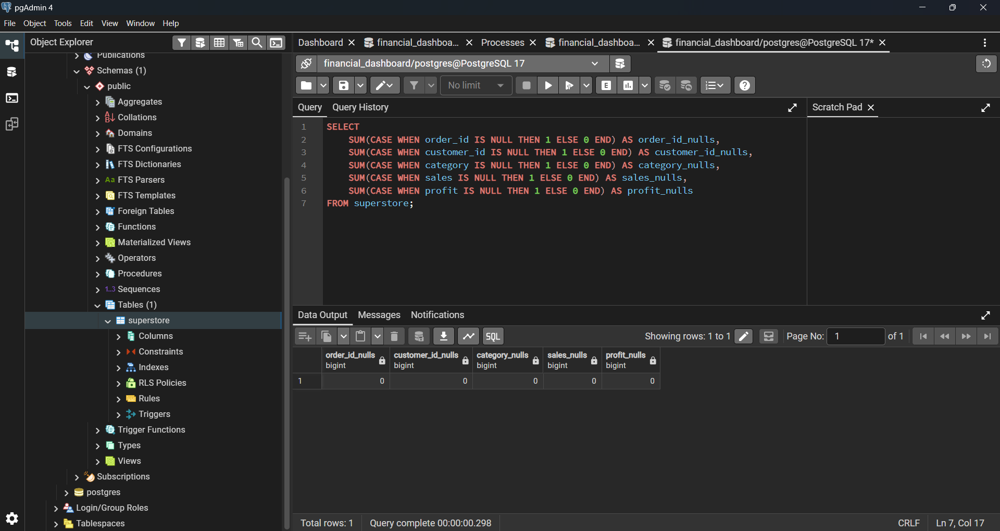
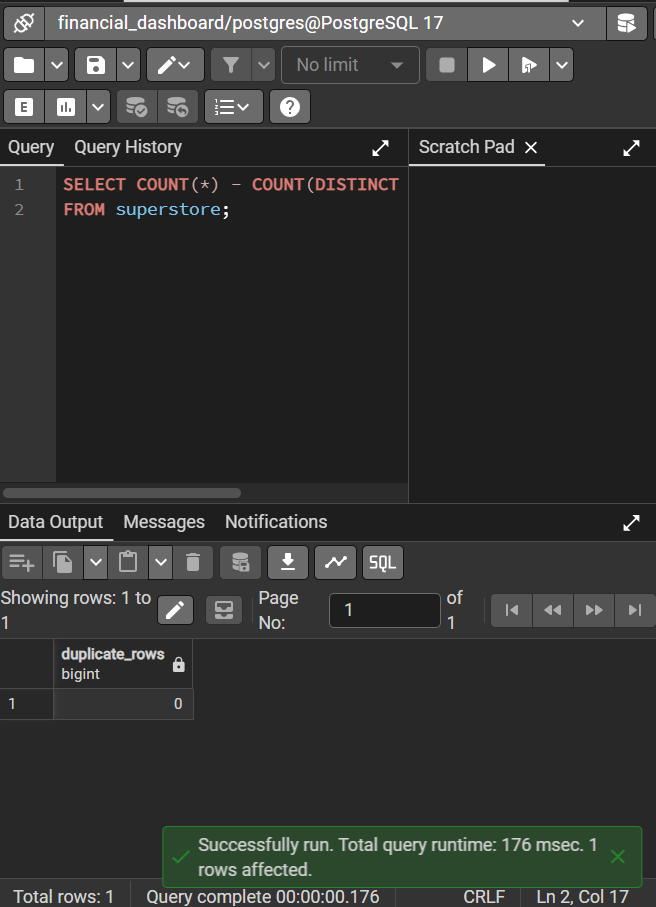
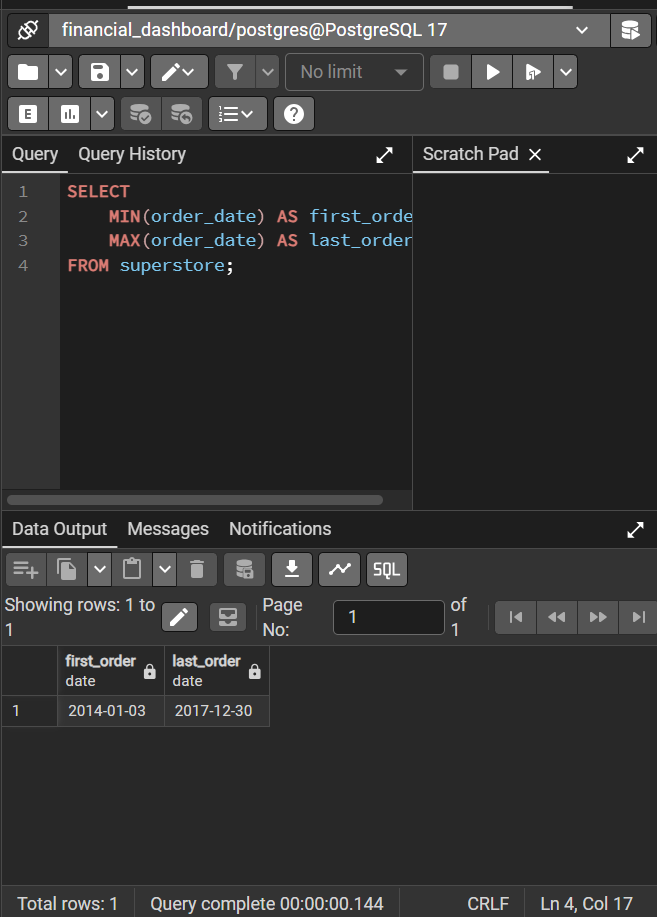
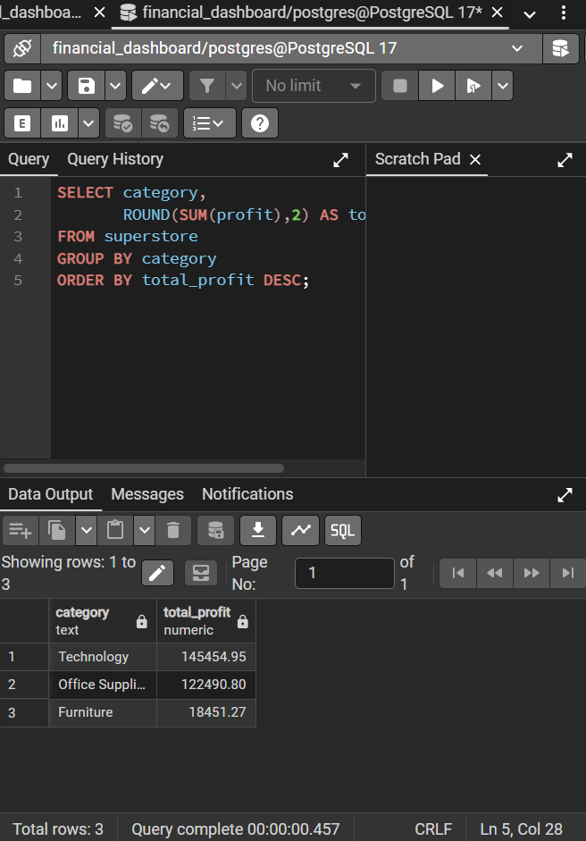

# Financial Performance Dashboard

## Objective
Develop an end-to-end financial dashboard using PostgreSQL and Power BI to analyse sales performance, profitability, discount impact and regional trends.

## Tools
- PostgreSQL
- SQL
- Power BI
- Power Query
- Git/GitHub
- Excel

## Dataset
Sample Superstore Dataset

## Project Progress

### Completed
- [x] Created GitHub repository
- [x] Designed project structure
- [x] Installed PostgreSQL 17
- [x] Created `financial_dashboard` database
- [x] Created `superstore` table
- [x] Imported 9,994 records into PostgreSQL
- [x] Performed initial SQL validation using `COUNT(*)`

### In Progress
- [ ] Exploratory SQL analysis
- [ ] Power BI dashboard development
- [ ] Business insights and recommendations
- [ ] README documentation improvements

## Project Structure

financial-dashboard-powerbi/
├── data/
│ ├── raw/
│ └── cleaned/
├── sql/
├── dashboard/
├── images/
└── README.md

## SQL Analysis

## Sales by Category
The initial SQL exploration identified Thechnology as the top-performing category in terms of sales

Category	Total Sales
Technology	836,154.03
Furniture	741,999.80
Office Supplies	719,047.03

SQL Query

SELECT category,
       ROUND(SUM(sales),2) AS total_sales
FROM superstore
GROUP BY category
ORDER BY total_sales DESC;

Query Result

## Data Quality Assessment

Before conducting the analysis, the dataset was assessed to ensure its suitability for business analysis.

The following checks were performed:

- Missing values assessment
- Duplicate records assessment
- Dataset temporal coverage validation

### Results

| Validation Check | Result |
|------------------|---------|
| Missing values | No missing values identified |
| Duplicate records | No duplicate records identified |
| Date range | Dataset covers the period from 2014 to 2017 |

The dataset was considered suitable for further analysis without requiring additional cleaning steps.

### SQL Validation

#### Null Values Check

#### Duplicate Records Check

#### Date Range Validation

## Exploratory SQL Analysis

### Profit by Category

Technology generated the highest profit ($145,544.95), followed by Office Supplies ($122,490.80).

Although Furniture represented one of the highest sales categories, it produced substantially lower profits ($18,451.27), suggesting potential margin challenges or the impact of discounts.

### Impact of Discounts on Profitability

An analysis of average profit by discount level revealed that small discounts (10%) were associated with higher average profits.

However, discount levels above 30% resulted in negative average profits, suggesting that aggressive discount strategies may significantly reduce overall profitability.

